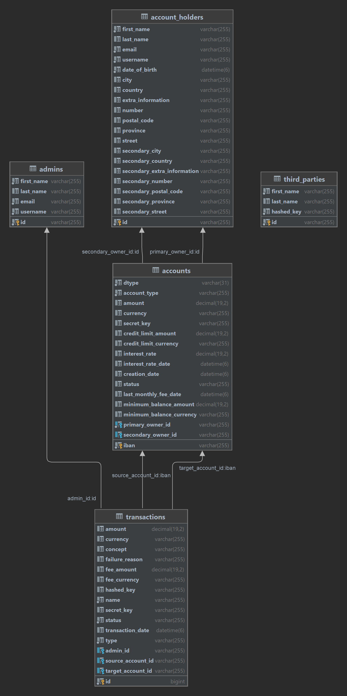
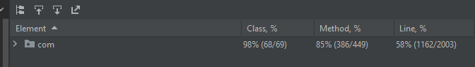
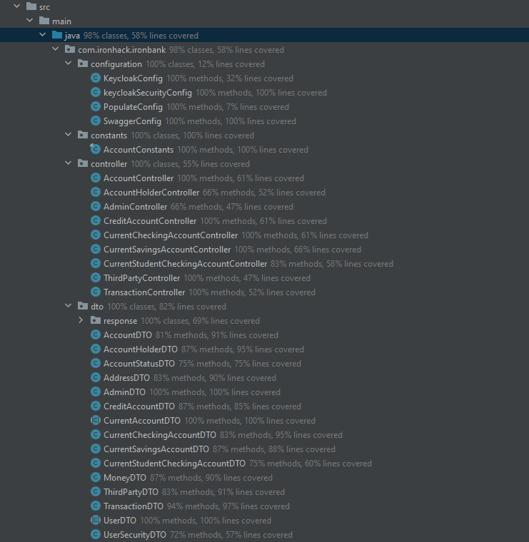
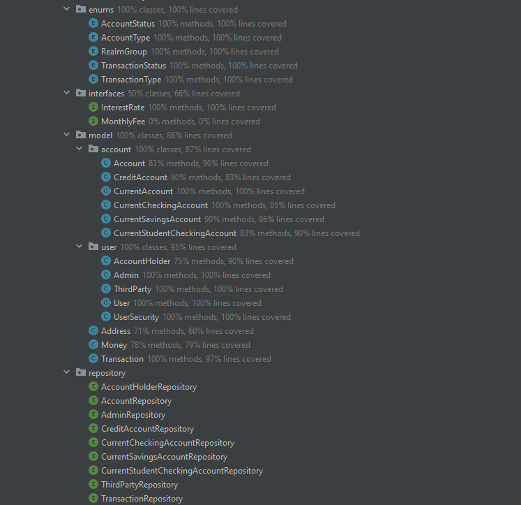
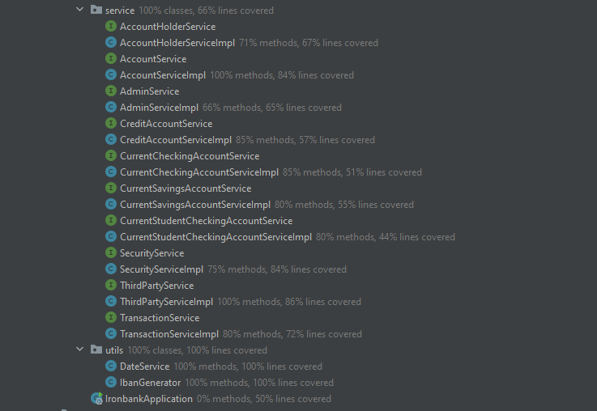

# IRONBANK

## Descripción
En este proyecto hemos desarrollado una aplicación web de principio a fin, es decir que cuenta con un backend y un frontend.
Su propósito se basa en la ayuda sobre la gestión de la creación de cuentas bancarias, asi como la gestión de las mismas y sus transacciones.
Cuenta con diferentes roles, los cuales son:
- Super Administrador
- Administrador
- Usuario (Account holder)

El super administrador es el encargado de crear los administradores y los usuarios, asi como de gestionarlos.

El administrador es el encargado de:
- Crear y administrar los usuarios (Account holders)
- Crear y administrar los Third Party
- Crear y administrar las cuentas bancarias
- Crear y administrar las transacciones

El usuario (Account holder) solo puede ver sus cuentas bancarias y sus transacciones.

A nivel de cuentas bancarias contamos con cuatro tipos diferentes:

- Checking accounts
- Savings accounts
- Student accounts
- Credit accounts

Las Student accounts tienen la particularidad de que no se pueden crear directamente y solo se crearan si al ir a crear una Checking account el primer Account Holder agregado tiene menos de 24 años.
Otra particularidad es que las Student accounts es que pueden tener saldo negativo al no tener un balance mínimo.
En cambio, las Checking account sí que tienen un balance mínimo y el usuario será penalizado cada vez que realize una operación que lo haga tener un saldo negativo.
Las checking account también tienen una comisión mensual por gastos de mantenimiento.

Las Savings accounts también aplicarán una penalización por tener el saldo por debajo del mínimo establecido, cada vez que se realize una operación con el saldo. Pero estas incorporan un interés anual, con lo que el cliente podrá ganar dinero por tener un saldo positivo.
Por último tenemos las Credit accounts, también aplican una penalización por el valor del saldo, pero en este caso únicamente cuando sea negativo, ya que en este tipo de cuentas nos tenemos que asegurar que el cliente pueda pagar la deuda. Estas cuentas tienen un interés total que se aplica de manera mensual, es decir dividiendo el interés total entre el número de meses.

En cuanto a tecnologías hemos usado:
- Java, Maven y Spring Boot para el backend
- Angular para el frontend
- MySQL para la base de datos
- Keycloak para la autenticación y autorización

## Diagrama de clases

En este diagrama de clases podemos observar como todo gira en torno a la clase Account, ya que es la que contiene todas las relaciones con las demás clases, menos con las third party, pero que están estrechamente relacionadas con las transacciones.
Las accounts tienen una relación OneToMany con las transacciones, porque una cuenta puede tener muchas transacciones.
Las accounts tienen una relación ManyToOne con los account holders, porque un account holder puede tener muchas accounts.
Las transacciones tienen una relación ManyToOne con los administradores, porque un administrador puede realizar muchas transacciones.
Por último los third party no tienen ninguna relación porque son personajes externos a la aplicación.

## Documentación de la API

La documentación de la API la podéis obtener de dos maneras distintas:
- Arrancando la aplicación del backend y accediendo al siguiente enlace: [Swagger](http://localhost:8080/swagger-ui.html)
- En la root del proyecto hay un archivo llamado "Ironbank Service API.postman_collection.json" que podéis importar en Postman.

## Test
El proyecto cuenta con test unitarios y de integración, los cuales se pueden ejecutar de dos maneras distintas:
- Para los tests unitarios simplemente hay que dirigirse a la carpeta "src/test/java" y ejecutar los test que se encuentran en la carpeta "/com/ironbank/ironbank/service" y en la carpeta "/com/ironbank/ironbank/utils".
- En cambio, para los test de integración hay que dirigirse a la carpeta "src/test/java" y ejecutar los test que se encuentran en la carpeta "/com/ironbank/ironbank/controller". Los comento por separado porque estos tienen el handicap de que los endpoints están configurados con seguridad y no permite la ejecución de estos de manera fácil y rápida. Se intentó hacer una configuración en base a una variable "isTest" añadiera la seguridad a los endpoints o no. Finalmente, no se consiguió porque daba un problema de CORS por lo que tuvimos que dejarlo usando la annotatión@RolesAllowed con lo que, por ahora, para lanzar estos tests se debería quitar antes todas las anotaciones.

Los tests usan una basa de datos distinta a la de la aplicación, por lo que no hay que preocuparse de que se modifiquen los datos de la base de datos de la aplicación.
Su nombre es "ironbank_test". Y también comentar que la primera vez que se lanzan los tests hay una clase de configuración que automáticamente rellena la base de datos con datos de prueba.

Por último, conseguimos una cobertura general de alrededor del 60% en los test unitarios y de integración y para la carpeta de los "service" llegamos al 66.5%.

## Configuración del entorno de desarrollo
Primero de todo, para poder desplegar la aplicación hay que tener instalado varias cosas:

### Java 17, Maven y IntelliJ Ultimate:
#### Windows

1. Instala [choco](https://chocolatey.org/install)
2. Desde Admin Shell, ejecute el siguiente código `choco install openjdk17 maven git intellijidea-ultimate -y`

#### MacOS

1. Instala Brew https://brew.sh/
2. `brew install openjdk@17` a continuación, siga la información en esta [página](https://formulae.brew.sh/formula/openjdk@17#default)
3. `brew install maven`
4. `brew install git`
5. `brew install --cask intellij-idea`

### MySQL:
#### Windows

1. Instalar el gestor de paquetes Chocolatey Windows desde [https://chocolatey.org/install](https://chocolatey.org/install)

Desde Admin Shell

>choco install mysql

Sus datos de connexión serán:
- user = 'root'
- psq = ''

3. Para instalar el MySQL-WorkBench
>choco install mysql.workbench

#### Mac OS

1. Asegúrese de que ha instalado brew, si no, ejecute el siguiente comando y siga las instrucciones:

>/bin/bash -c "$(curl -fsSL https://raw.githubusercontent.com/Homebrew/install/HEAD/install.sh)"

2. Ejecutar [following command](https://formulae.brew.sh/formula/mysql) para instalar MySql

>brew install mysql

3. Arrancar el servicio de MySql:
>brew services start mysql

4. Además, puede ejecutar el siguiente comando para activar las funciones de seguridad y establecer una contraseña:

>mysql_secure_installation

5. Descargue MySQL Workbench desde el siguiente enlace: [https://dev.mysql.com/downloads/workbench/](https://dev.mysql.com/downloads/workbench/)

6. El proceso para instalar MySQL Workbench es arrastrarlo y soltarlo en tu carpeta de aplicaciones. Después de eso usted debe ser capaz de ejecutarlo.

### Keycloak:
1. Siga la información en esta página [Keycloak]( https://www.keycloak.org/downloads)
2. Desde Admin Shell te diriges a la carpeta `/bin` y ejecutas el siguiente comando `.\kc.bat start-dev --http-port 8181`

### Node, npm y Angular:
1. Siga la información en esta página [Node](https://nodejs.org/es/download/)
2. Siga la información en esta página [Angular](https://angular.io/guide/setup-local)

## Despliegue de la aplicación
Para desplegar la aplicación hay que seguir los siguientes pasos:
Keycloak:
    - Desde Admin Shell te diriges a la carpeta `/bin` y ejecutas el siguiente comando `.\kc.bat start-dev --http-port 8181`
    - Accede a la siguiente url: [http://localhost:8181/](http://localhost:8181/)
    - Create un usuario y accede al panel de administración
    - Crea un nuevo realm llamado "ironbank" y importa el archivo "ironbank-realm.json" que se encuentra en la carpeta "src/main/resources" de la aplicación.
    - Añade un nuevo user llamado "superadmin" y asignale el rol "realm-super-admin". También añádale una contraseña.

MySQL:
    - Crea una instancia local en el puerto 3306

Backend:
    - Accede a la carpeta "/backend" del repositorio y revisa el archivo "application.properties" y adáptalo a tu entorno.
    - Desde el IDE ejecuta la clase "IronbankApplication.java" que se encuentra en la carpeta "src/main/java/com/ironbank/ironbank" de la aplicación.

Frontend:
    - Accede a la carpeta "/frontend" del repositorio y ejecuta el siguiente comando `npm install`
    - Luego ejecuta el siguiente comando `ng serve`

## Como usar la aplicación
Para usar la aplicación hay que seguir los siguientes pasos:
1. Accede a la siguiente url: [http://localhost:4200/](http://localhost:4200/)
2. Accede con el usuario "superadmin" y la contraseña que le has asignado. Ten en cuenta que a veces no accede al dashboard a la primera y hay que darle varias veces al botón "Login" o recargar la página.
3. Desde el dashboard puedes crear nuevos usuarios con roles de realm-admin y realm-user, con los que accederás a diferentes funcionalidades de la aplicación.

## A tener en cuenta
1. Cuando se arranca la aplicación por primera vez, hay una configuración "populate" que rellena la base de datos. Los usuarios creados tienen por defecto la contraseña "password".
2. Desde el frontend, por ahora, solo se pueden crear Checking accounts. Y estas dependiendo de la edad del primer titular, generarán una Checking account o una Student account.

